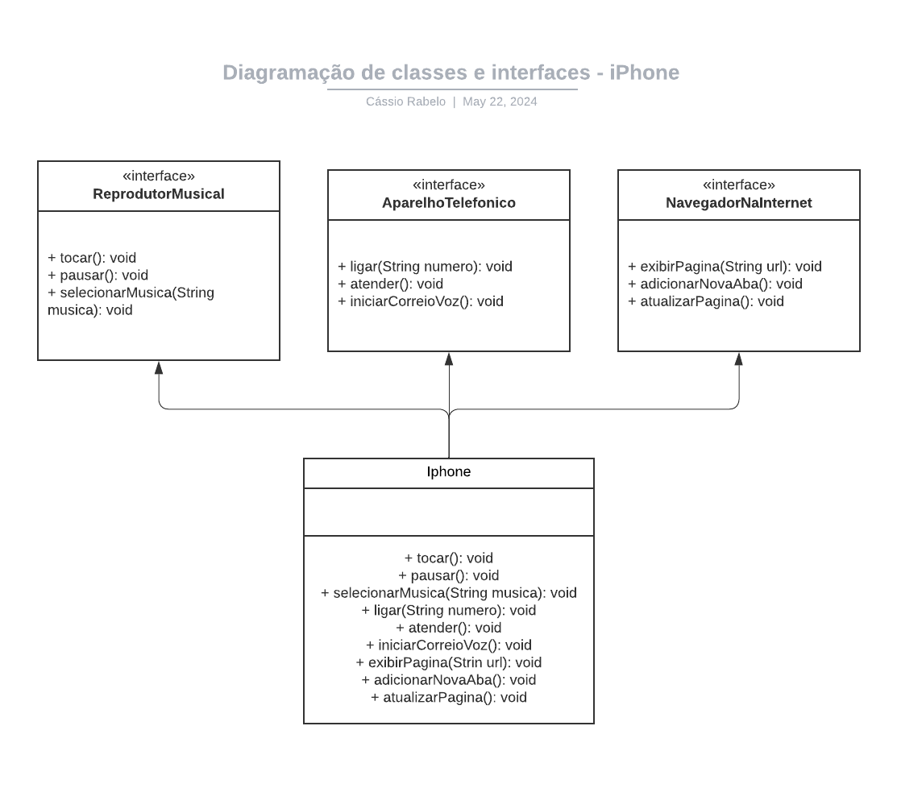

# dio-driagrama-classes

Resolução do desafio [Modelando o iPhone com UML: Funções de Música, Chamadas e Internet](https://github.com/digitalinnovationone/trilha-java-basico/tree/main/desafios/poo) proposto pelo [Gleyson Sampaio](https://github.com/glysns) na [DIO](https://github.com/digitalinnovationone), para práticas de análise de negócios, requisitos, conceitos da programação orientada a objetos e modelagem UML.

## Modelagem e Diagramação UML

